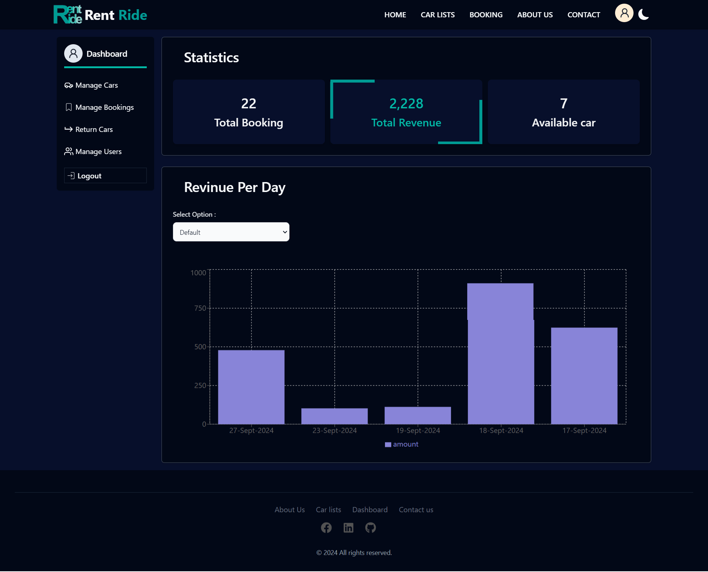

# Car Rental Reservation System

<p align="center">
  
</p>

A user-friendly car rental reservation platform with features for both customers and administrators. The system offers seamless browsing, booking, and management of cars, while providing administrators with the necessary tools to manage inventory and reservations.

## Features

### User Features

1. **Home Page**:

   - Responsive design with a "Book Now" call-to-action button.
   - Search bar for checking car availability based on location and dates.
   - Featured cars carousel displaying car descriptions and pricing.
   - Customer testimonials and unique selling points (e.g., best prices, wide selection, 24/7 support).

2. **Car Listings**:

   - Filter cars by type (SUV, sedan, etc.), price, and features.
   - Display car details with images, pricing, and a "View Details" button.

3. **Car Details Page**:

   - Detailed car descriptions including features, pricing, and high-quality images.
   - Additional options for insurance, GPS, child seats, etc.
   - "Book Now" button leading to the booking page.

4. **User Dashboard**:

   - View personal information and booking history.
   - Modify or cancel bookings (before admin approval).
   - Pay the amount after car return.

5. **Booking System**:

   - Search available cars by type, location, dates, and features.
   - Secure booking process with input for personal details and payment information.
   - Review and confirm booking details before finalizing the reservation.

6. **Authentication**:

   - Sign-up with email and password.
   - Secure login with session management.
   - Password recovery option.
   - Profile management.

     ##

### Admin Features

1. **Admin Dashboard**:

   - Overview of total bookings, available cars, revenue statistics.
   - View and manage car listings, bookings, and user data.
   - Add, update, or delete car listings.
   - Approve or cancel user bookings.
   - Return cars after payment completion and mark them as available.
   - Generate reports (optional).

2. **Car Management**:

   - Add new cars with details (name, model, year, price, and features).
   - Update existing car information.
   - Delete car listings when necessary.

3. **Booking Management**:

   - View all bookings, and approve or cancel them as needed.
   - Manage returned cars and update their availability status.

4. **User Management**:

   - Manage users and admin accounts.
   - Promote users to admin or block/unblock accounts.
   - Change user roles (user to admin).

     ##

### General Features

1. **Error Handling**:

   - Display user-friendly error messages for unavailable cars, invalid routes, or failed operations.
   - Custom 404 page with navigation to safe pages like Home and Login.

2. **Responsive Design**:

   - Fully responsive interface ensuring a seamless experience across mobile, tablet, and desktop devices.

3. **Secure Payment**:

   - Users can complete payments after returning cars.
   - Integration with local payment methods such as AmarPay or SSLCommerz.

4. **Authentication & Authorization**:

   - Role-based access control for users and admins.
   - Secure sign-in and session management.

     ##

### Technologies Used

- **Frontend**: React, TypeScript
- **Backend**: Node.js, Express
- **Database**: MongoDB
- **State Management**: Redux Toolkit
- **Authentication**: JWT (JSON Web Tokens)
- **Payment Integration**: SSLCommerz/AmarPay (Optional)
- **Deployment**: Vercel (API)

  ##

## Screenshots

- ### Home page

<p align="center">
  
</p>

##

- ### Car List Page

<p align="center">
  
</p>

##

- ### Booking Car List Page

<p align="center">
  
</p>

##

- ### About us page

    <p align="center">
    
  </p>

  ##

- ### Contact us page

    <p align="center">
    
  </p>

  ##

- ### User Dashboard


##

- ### Admin Dashboard

<p align="center">
  
  
  
  
  
</p>

## Installation

1.  Clone the repository:

```bash
git clone https://github.com/MoniruzzamanBillal/RentRide
```

##

### Credentials :

**Admin Email**: abc@d.com
**Frontend**: 123456

##

### live llink : https://rent-ride-ivory.vercel.app/
